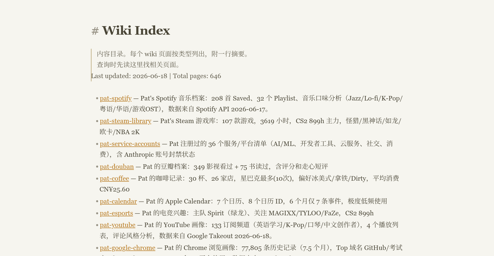

# All in One LLM Wiki

> [中文版](README.md) | English

[](https://github.com/perinchiang/all-in-one-llm-wiki)

▶️ [Video Demo](https://www.bilibili.com/video/BV1qqji6rEyp/) ｜ 🖼️ [Visual Overview](https://www.cutenote.app/notes/856fb4a1-a62c-4836-92a4-b4a9dcde2310)



Export your digital life into an **AI-readable LLM Wiki**, so your Agent no longer has to start from scratch getting to know you.

This is not a "pretty knowledge base for humans." It's more like a long-term context layer for AI/Agents: organizing notes, AI memory, music, movies, video platforms, browsers, health, games, toolchains, NAS, and other data into a structured Markdown Wiki, so that Agents can understand your real background when answering, recommending, planning, and automating.

Just like you wouldn't read all your notes at once - you'd check the table of contents first, then flip to the page you need. The Wiki distills raw data from every platform into a structured index. The Agent loads on demand, no need to ingest everything.

## Compatible Agents

This is a general Agent Skill. Any agent that can read `SKILL.md` and local files can use it:

- [OpenClaw](https://github.com/openclaw)
- [Hermes Agent](https://hermes-agent.nousresearch.com/)
- [WorkBuddy](https://workbuddy.ai/)
- [Claude Code](https://claude.ai/)
- [HanaAgent](https://github.com/liliMozi/openhanako)
- Any other LLM Agent with Skill / Tool / MCP support

## Quick Install

```bash
git clone https://github.com/perinchiang/all-in-one-llm-wiki
```

Or just send this to your LLM Agent:

> Use https://github.com/perinchiang/all-in-one-llm-wiki to create a private .wiki/ in my Obsidian vault from my exported Bilibili/Spotify/AI memory files.

## Before / After

**Without LLM Wiki:**

```text
You: Recommend a movie
Agent: “Inception” is a classic Nolan film with high ratings... (generic)
```

**With LLM Wiki:**

```text
You: Recommend a movie
Agent: You've marked 327 movies as “watched” on Douban, with ratings
concentrated in the 7-8 range. You prefer thriller and sci-fi, and
tend to rate pure romance films lower. Your recent Bilibili favorites
include some “high-IQ mind-bending” clips, let me take a look...
Found it! I'd recommend “The Invisible Guest” — a Spanish thriller
with tight pacing. A movie this perfect for you and you haven't seen
it yet? Or would you prefer something lighter to unwind today?
```

The Wiki transforms your Agent from "generic encyclopedia" into "assistant that actually knows you."

## What Problem Does It Solve

The problem with ordinary AI conversations is: every time you have to re-explain who you are, what you're doing, what you like, what tools you have, and what stage you're at.

The goal of All in One LLM Wiki is:

- Organize data scattered across various platforms into a Wiki that AI can search and reference.
- Preserve source, confidence, and privacy boundaries to avoid turning into an un-auditable "personality guess."
- Let Agents act based on real context instead of just giving generic advice.

For example:

- After importing Spotify, the Agent can select playlists based on your music taste and current context.
- After importing Douban, the Agent no longer recommends movies and books based only on trending charts.
- After importing Bilibili / YouTube, the Agent can understand what learning and entertainment topics you're actually following recently.
- After importing Chrome / Google Takeout, the Agent can understand your toolchain, project context, and attention distribution.
- After importing Garmin / Apple Health, the Agent can combine sleep, steps, and exercise records to give more grounded lifestyle advice.
- After importing AI platform memories, the Agent can merge fragmented understandings of you from multiple AIs, reducing repeated explanations.

## Data Ingestion Overview

| Entry Point | Recommended Export Method | What to Distill | Privacy Level |
| --- | --- | --- | --- |
| Obsidian / Local Notes | Directly read Markdown folder | Learning stages, projects, concepts, terminology | Medium |
| AI Platform Memory | Ask platform / export long-term memory, manually save as Markdown | Cross-platform self-profile, preferences, long-term goals | High |
| Bilibili | `bilibili-cli` login then export history / favorites / following | Current interests, learning videos, creator preferences | Medium-High |
| Garmin | Python `garminconnect` script to pull summaries | Sleep, steps, exercise, recovery suggestions | High |
| Apple Health | iPhone Health App avatar → Export All Health Data | Long-term health trends, exercise history | High |
| Spotify | Spotify Web API / OAuth | Music taste, scene playlists, artist preferences | Medium |
| Douban | Save profile page / entry data or self-crawl, parse ratings and short reviews | Movie, book, game taste | Medium |
| Google Takeout | Chrome / YouTube export | Browser toolchain, YouTube subscriptions and playlists | High |
| Steam | Steam Web API | Game library, playtime, game genre preferences | Medium |
| NAS / Media Library | SSH scan + MoviePilot/qBittorrent/Jellyfin API | Local media library, automation capabilities | High |
| Calendar | ICS / CalDAV / platform export | Schedule, low-frequency / high-frequency events | High |
| Coffee / Lifestyle Logs | Markdown, CSV, spreadsheet, or manual logs | Lifestyle preferences, spending habits, routine clues | Medium |
| Service Accounts / Toolchain | Manual checklist, email summary, password manager category export | Available tools, cloud services, automation platforms | High |

> Detailed export methods (with code, scripts, and privacy advice): [docs/export-guides_EN.md](docs/export-guides_EN.md)

## Directory Structure

```text
.wiki/                    # Private knowledge base, do not commit to Git by default
  SCHEMA.md
  index.md
  log.md
  raw/
    ai-memory/
    platform-exports/
    health/
    notes/
  entities/
  concepts/
  queries/
  _archive/
```

Basic workflow:

1. First, set up the Wiki structure: `SCHEMA.md`, `index.md`, `log.md`, `raw/`, `entities/`, `concepts/`.
2. For each source you import, first place the raw export into the corresponding `raw/` directory.
3. Then generate one or more `entities/` or `concepts/` pages.
4. Write a one-line summary in `index.md` so the Agent can read the directory first.
5. Record the source, time, import method, and privacy handling in `log.md`.
6. For sensitive sources, only save aggregate summaries, not the raw data.

## Security & Privacy

Default principles: **local-first, privacy-first, anonymize before sharing**.

Core measures: `.wiki/` hidden folder + `.gitignore` excludes raw data + permission layering (Agent reads summary layer by default, not raw layer).

> Full security plan, `.gitignore` template, permission layering, and encryption advice: [docs/security_EN.md](docs/security_EN.md)

## Page Template

Each entity page should include:

```markdown
---
title: Example Profile
created: YYYY-MM-DD
updated: YYYY-MM-DD
type: entity
tags: [profile, source-name]
sources: [raw/platform-exports/example.json]
confidence: high
---

# Example Profile

> One sentence explaining what this page helps the Agent understand.

## Overview

| Dimension | Value |
| --- | --- |
| Source | API / export / manual |
| Date range | YYYY-MM-DD to YYYY-MM-DD |
| Confidence | high |

## Findings

- Fact 1
- Fact 2
- Inference: must be labeled as inference

## Agent affordances

- What the Agent can now do.
- What the Agent should avoid.

## Open questions

- Points requiring user confirmation.

## Cross-links

- [[related-page]]
```

## Recommended `log.md` Format

```markdown
## [YYYY-MM-DD] ingest | Source name
- Source: export/API/manual source
- Method: command, script, or manual steps
- Created:
  - entities/example.md - summary
- Updated:
  - index.md - added source summary
- Privacy: raw data private; public version uses aggregates only
- Notes: parser assumptions, skipped files, anomalies
```

## Appendix

- This project is inspired by Karpathy's [LLM-Wiki](https://github.com/karpathy/llm-wiki) concept and can serve as the data ingestion layer for `llm-wiki`.
- Before publishing, use `PUBLISHING_CHECKLIST.md` as a final pass.
